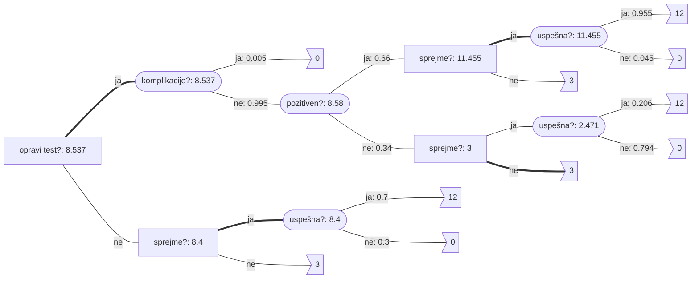
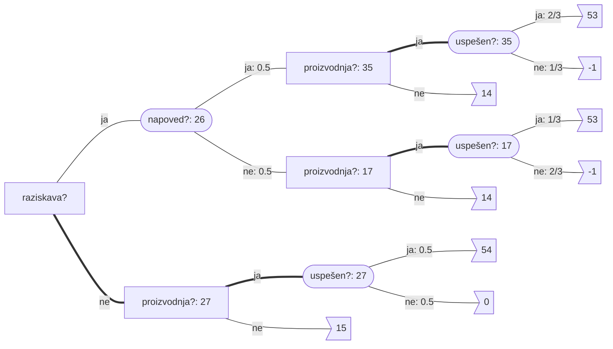
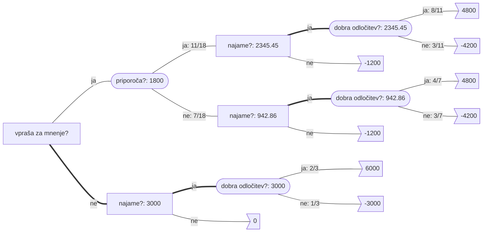

# Operacijske raziskave - vaje 23.3.2020

---

## Odločitvena drevesa

### Naloga 1

Imaš sledeče odločitveno drevo, a nisi prepričan glede vrednosti $p \in [0, 1/3]$. Poišči optimalne odločitve glede na vrednost $p$. Pričakovano vrednost želimo maksimizirati.

```mermaid
graph LR

A[A] -- p < 5/19 --- B[B]
A -- p >= 5/19 --- C([C: 22p-5])
B -- p > 2/7 --- D([D: 10p-2])
B == p <= 2/7 === E([E: 3p])
C -- p --- F>10]
C -- p --- G>2]
C -- 1-2p --- H>-5]
D -- 2p --- I>3]
D -- 1-2p --- J>-2]
E -- 3p --- K>1]
E -- 1-3p --- L>0]
```
----

$$
\begin{alignedat}{2}
E(D) &= 2p \cdot 3 + (1-2p) \cdot (-2) &&= 10p - 2 \\
E(E) &= 3p \cdot 1 + (1-3p) \cdot 0 &&= 3p \\
E(C) &= p \cdot 10 + p \cdot 2 + (1-2p) \cdot (-5) &&= 22p - 5
\end{alignedat}
$$

$$
\begin{aligned}
10p - 2 &> 3p \\
7p &> 2 \\
p &> 2/7
\end{aligned}
$$

$$
E(B) = 
\begin{cases}
10p - 2 & p > 2/7 \\
3p & p \le 2/7
\end{cases}
$$

$$
\begin{aligned}
3p &> 22p - 5 \\
19p &< 5 \\
p &< 5/19 < 2/7
\end{aligned}
$$

$$
\begin{aligned}
10p - 2 &> 22p - 5 \\
12p &< 3 \\
p &< 1/4 < 2/7
\end{aligned}
$$

$$
E(A) = 
\begin{cases}
3p & p < 5/19 \\
22p - 5 & p \ge 5/19
\end{cases}
$$


---

### Naloga 2

Pacient ima na voljo operacijo. Brez operacije bo živel natanko $3$ mesece. Z uspešno opravljeno operacijo bo živel natanko $12$ mesecev. Operacija je neuspešna z verjetnostjo $0.3$ (v tem primeru pacient dočaka $0$ mesecev). Cilj pacienta je maksimiranje pričakovane življenjske dobe.

1. Ali naj pacient sprejme operacijo?
2. Pacient lahko opravi predhodni test, ki z zanesljivostjo $0.9$ napove uspešnost operacije, vendar z verjetnostjo $0.005$ pacient zaradi komplikacij med testom umre. Ali naj pacient opravi test?

Nariši odločitveno drevo in odločitve sprejmi na podlagi izračunanih verjetnosti!

----

$$
\begin{aligned}
X &\dots \text{čas življenja} \\
A &\dots \text{operacija uspešna} \\
B &\dots \text{sprejme operacijo} \\
C &\dots \text{opravi test} \\
D &\dots \text{test poztiven} \\
E &\dots \text{komplikacije}
\end{aligned}
$$

$$
\begin{aligned}
P(A) &= 0.7 \\
P(\lnot A) &= 0.3 \\[1ex]
E(X \mid \lnot C \land \lnot B) &= 3 \\
E(X \mid \lnot C \land B \land A) &= 12 \\
E(X \mid \lnot C \land B \land \lnot A) &= 0 \\[1ex]
E(X \mid \lnot C \land B) &= 0.7 \cdot 12 + 0.3 \cdot 0 = 8.4 \\[1ex]
P(D \mid A) &= 0.9 \\
P(\lnot D \mid A) &= 0.1 \\
P(\lnot D \mid \lnot A) &= 0.9 \\
P(D \mid \lnot A) &= 0.1 \\[1ex]
P(E \mid C) &= 0.005 \\[1ex]
P(D) &= 0.9 \cdot 0.7 + 0.1 \cdot 0.3 = 0.66 \\
P(\lnot D) &= 0.1 \cdot 0.7 + 0.9 \cdot 0.3 = 0.34
\end{aligned}
$$

$$
\begin{alignedat}{3}
P(A \mid D) &= {P(D \mid A) \cdot P(A) \over P(D)} &&= {0.9 \cdot 0.7 \over 0.66} &&\approx 0.955 \\
P(\lnot A \mid D) &= {P(D \mid \lnot A) \cdot P(\lnot A) \over P(D)} &&= {0.1 \cdot 0.3 \over 0.66} &&\approx 0.045 \\
P(A \mid \lnot D) &= {P(\lnot D \mid A) \cdot P(A) \over P(\lnot D)} &&= {0.1 \cdot 0.7 \over 0.34} &&\approx 0.206 \\
P(\lnot A \mid \lnot D) &= {P(\lnot D \mid \lnot A) \cdot P(\lnot A) \over P(\lnot D)} &&= {0.9 \cdot 0.3 \over 0.34} &&\approx 0.794
\end{alignedat}
$$

----



Pacient naj se odloči za testiranje - če to da pozitiven rezultat, naj se odloči za operacijo, sicer pa ne. Pričakovana življenjska doba je $8.537$ mesecev.

---

### Naloga 3

Podjetje je razvilo produkt, za katerega je konkurenca pripravljena plačati $15 M€$. Če se odločijo samostojno prodajati produkt, jih vzpostavitev proizvodnje stane $6 M€$, za vsak uspešno prodan produkt pa dobijo $600 €$. Računajo, da bi z verjetnostjo $0.5$ investicija uspela in bi prodali $100000$ produktov, z verjetnostjo $0.5$ pa bi projekt propadel in bi prodali zgolj $10000$ produktov. Podjetje se lahko odloči tudi za neodvisno raziskavo trga. Ta stane $1 M€$, z verjetnostjo $2/3$ pa bo pravilno napovedala uspeh projekta (ne glede na to, ali bi ta uspel ali ne). Kako naj se podjetje odloči?

----

$$
\begin{aligned}
X &\dots \text{zaslužek} \\
A &\dots \text{opravijo raziskavo} \\
B &\dots \text{napove uspeh} \\
C &\dots \text{vzpostavijo proizvodnjo} \\
D &\dots \text{projekt uspešen}
\end{aligned}
$$

$$
\begin{aligned}
E(X \mid \lnot A \land \lnot C) &= 15 M€ \\
E(X \mid A \land \lnot C) &= 14 M€ \\
E(X \mid \lnot A \land C \land D) &= 54 M€ \\
E(X \mid A \land C \land D) &= 53 M€ \\
E(X \mid \lnot A \land C \land \lnot D) &= 0 M€ \\
E(X \mid A \land C \land \lnot D) &= -1 M€ \\[1ex]
P(D) &= 0.5 \\
P(\lnot D) &= 0.5 \\[1ex]
P(B \mid D) &= 2/3 \\
P(\lnot B \mid D) &= 1/3 \\
P(B \mid \lnot D) &= 1/3 \\
P(\lnot B \mid \lnot D) &= 2/3 \\[1ex]
P(B) &= 2/3 \cdot 0.5 + 1/3 \cdot 0.5 = 0.5 \\
P(\lnot B) &= 0.5 \\[1ex]
P(D \mid B) &= 2/3 \cdot 0.5 / 0.5 = 2/3 \\
P(D \mid \lnot B) &= 1/3 \cdot 0.5 / 0.5 = 1/3
\end{aligned}
$$

----



---

### Naloga 4

Rexhep Bajrami bi se rad naslednja štiri leta ukvarjal s prodajo sadja in zelenjave (po štirih letih mu poteče delovna viza). Rad bi najel parcelo za stojnico, ki bo stala $6000 €$. Če je lokacija dobra, bo imel $12000 €$ dobička, če pa je lokacija slaba, bo imel le $3000 €$ dobička. Ocenjuje, da je z verjetnostjo $2/3$ lokacija dobra, z verjetnostjo $1/3$ pa slaba.

1. Z odločitvenim drevesom opiši njegove možnosti in ugotovi, kako naj se odloči ter kakšen dobiček naj pričakuje.
2. Za nasvet lahko vpraša znanca Seada, ki "ima nos" za tovrstne posle. Sead mu lahko da nasvet, a zanj zahteva $1200 €$. Dobro je znano, da ima Sead naslednje pogojne verjetnosti $P(\text{Seadovo mnenje} \mid \text{kakovost parcele})$:

|               | dobra | slaba |
| ------------- | ----- | ----- |
| **priporoča** | $2/3$ | $1/2$ |
| **odsvetuje** | $1/3$ | $1/2$ |

Ali naj vpraša Seada za nasvet? Kakšen je pričakovani dobiček?

----


$$
\begin{aligned}
X &\dots \text{dobiček} \\
A &\dots \text{vprašamo za mnenje} \\
B &\dots \text{priporoča} \\
C &\dots \text{najem} \\
D &\dots \text{dobra odločitev}
\end{aligned}
$$

$$
\begin{aligned}
E(X \mid \lnot A \land \lnot C) &= 0 \\
E(X \mid A \land \lnot C) &= -1200 \\
E(X \mid \lnot A \land C \land D) &= 6000 \\
E(X \mid \lnot A \land C \land \lnot D) &= -3000 \\
E(X \mid A \land C \land D) &= 4800 \\
E(X \mid A \land C \land \lnot D) &= -4200 \\[1ex]
P(B \mid D) &= 2/3 \\
P(\lnot B \mid D) &= 1/3 \\
P(B \mid \lnot D) &= 1/2 \\
P(\lnot B \mid \lnot D) &= 1/2
\end{aligned}
$$


---

### Naloga 5

Mudi se ti na izpit, a ravno v trenutku, ko prideš na postajo Konzorcij, odpelje avtobus številka 1. Na prikazovalniku se izpiše, da bo naslednji avtobus številka 1 prispel čez $10$ minut, naslednji avtobus številka 6 čez $6$ minut, naslednji avtobus številka 14 pa čez $2$ minuti.

Avtobusa 1 in 6 ob ugodnih semaforjih potrebujeta $6$ minut do postaje pri FE, pri čemer se lahko čas vožnje zaradi rdeče luči na semaforju pri FF podaljša za $1$ minuto. Verjetnosti, da bo rdečo luč imel avtobus 1, da bo rdečo luč imel avtobus 6, ter da bosta oba avtobusa imela zeleno luč, so enake $1/3$ (zaradi majhnega razmaka se ne more zgoditi, da bi oba avtobusa naletela na rdečo luč). Avtobus številka 1 nadaljuje pot do postaje pri FMF, za kar potrebuje še $2$ minuti.

Avtobus številka 14 potrebuje $5$ minut do postaje pri študentskih domovih, od tam pa greš peš do postaje pri FE, za kar potrebuješ še $4$ minute. Pri tem prečkaš železnico -- če mimo pripelje vlak (kar se zgodi z verjetnostjo $0.05$), se čas hoje podaljša za $3$ minute. Ko prideš na postajo pri FE (ne glede na to, ali si prišel z avtobusom 6 ali 14), te čakajo še $4$ minute hoje do FMF, vendar moraš najprej prečkati Tržaško cesto. Če je na semaforju rdeča luč (kar se zgodi z verjetnostjo 0.9, neodvisno od drugih dogodkov), se lahko odločiš, da $2$ minuti počakaš na zeleno luč in potem nadaljuješ peš, ali pa da greš nazaj do postaje in počakaš na avtobus številka $1$ (ki bo, tako kot prej, vozil še $2$ minuti do FMF).

Kakšne bodo tvoje odločitve, da bo pričakovano trajanje poti do FMF čim krajše? Nariši odločitveno drevo in odločitve sprejmi na podlagi izračunanih verjetnosti!

----


