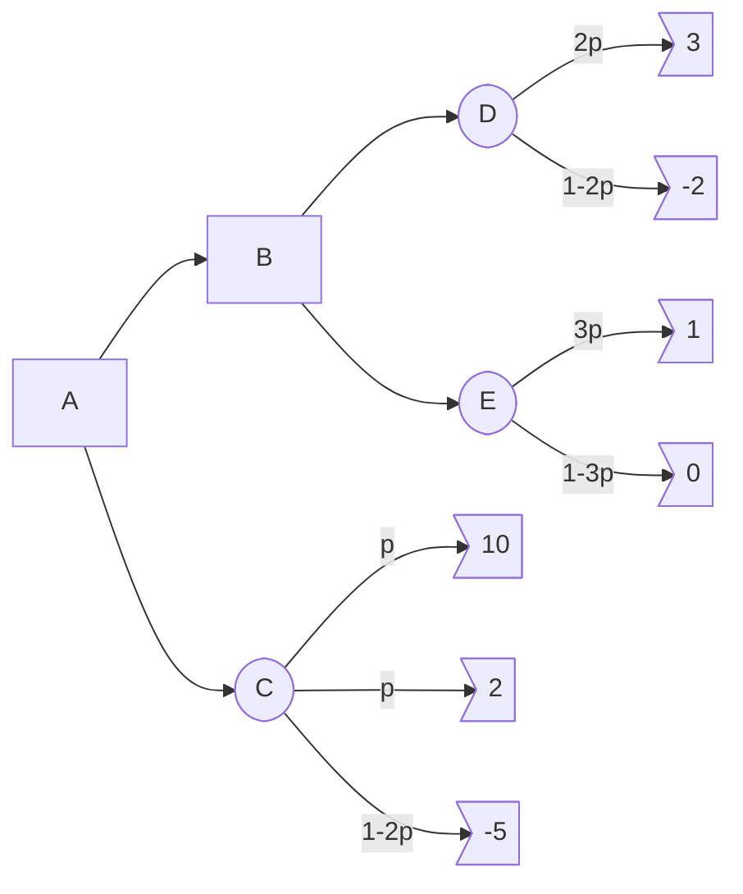

# Operacijske raziskave - vaje 23.3.2020

---

## Odločitvena drevesa

### Naloga 1

Imaš sledeče odločitveno drevo, a nisi prepričan glede vrednosti $p \in [0, 1/3]$. Poišči optimalne odločitve glede na vrednost $p$.

---

### Naloga 2

Pacient ima na voljo operacijo. Brez operacije bo živel natanko $3$ mesece. Z uspešno opravljeno operacijo bo živel natanko $12$ mesecev. Operacija je neuspešna z verjetnostjo $0.3$ (v tem primeru pacient dočaka $0$ mesecev). Cilj pacienta je maksimiranje pričakovane življenjske dobe.

1. Ali naj pacient sprejme operacijo?
2. Pacient lahko opravi predhodni test, ki z zanesljivostjo $0.9$ napove uspešnost operacije, vendar z verjetnostjo $0.005$ pacient zaradi komplikacij med testom umre. Ali naj pacient opravi test?

Nariši odločitveno drevo in odločitve sprejmi na podlagi izračunanih verjetnosti!

---

### Naloga 3

Podjetje je razvilo produkt, za katerega je konkurenca pripravljena plačati $15 M€$. Če se odločijo samostojno prodajati produkt, jih vzpostavitev proizvodnje stane $6 M€$, za vsak uspešno prodan produkt pa dobijo $600 €$. Računajo, da bi z verjetnostjo $0.5$ investicija uspela in bi prodali $100000$ produktov, z verjetnostjo $0.5$ pa bi projekt propadel in bi prodali zgolj $10000$ produktov. Podjetje se lahko odloči tudi za neodvisno raziskavo trga. Ta stane $1 M€$, z verjetnostjo $2/3$ pa bo pravilno napovedala uspeh projekta (ne glede na to, ali bi ta uspel ali ne). Kako naj se podjetje odloči?

---

### Naloga 4

Rexhep Bajrami bi se rad naslednja štiri leta ukvarjal s prodajo sadja in zelenjave (po štirih letih mu poteče delovna viza). Rad bi najel parcelo za stojnico, ki bo stala $6000 €$. Če je lokacija dobra, bo imel $12000 €$ dobička, če pa je lokacija slaba, bo imel le $3000 €$ dobička. Ocenjuje, da je z verjetnostjo $2/3$ lokacija dobra, z verjetnostjo $1/3$ pa slaba.

1. Z odločitvenim drevesom opiši njegove možnosti in ugotovi, kako naj se odloči ter kakšen dobiček naj pričakuje.
2. Za nasvet lahko vpraša znanca Seada, ki "ima nos" za tovrstne posle. Sead mu lahko da nasvet, a zanj zahteva $1200 €$. Dobro je znano, da ima Sead naslednje pogojne verjetnosti $P(\text{Seadovo mnenje} \mid \text{kakovost parcele})$:

|               | dobra | slaba |
| ------------- | ----- | ----- |
| **priporoča** | $2/3$ | $1/2$ |
| **odsvetuje** | $1/3$ | $1/2$ |

Ali naj vpraša Seada za nasvet? Kakšen je pričakovani dobiček?