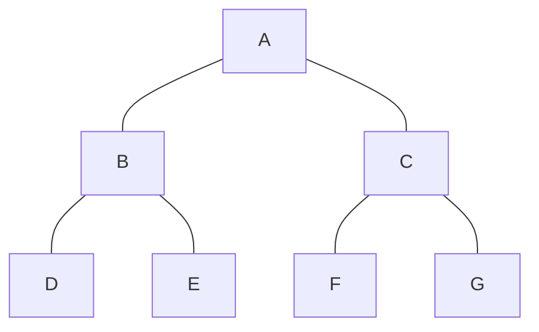
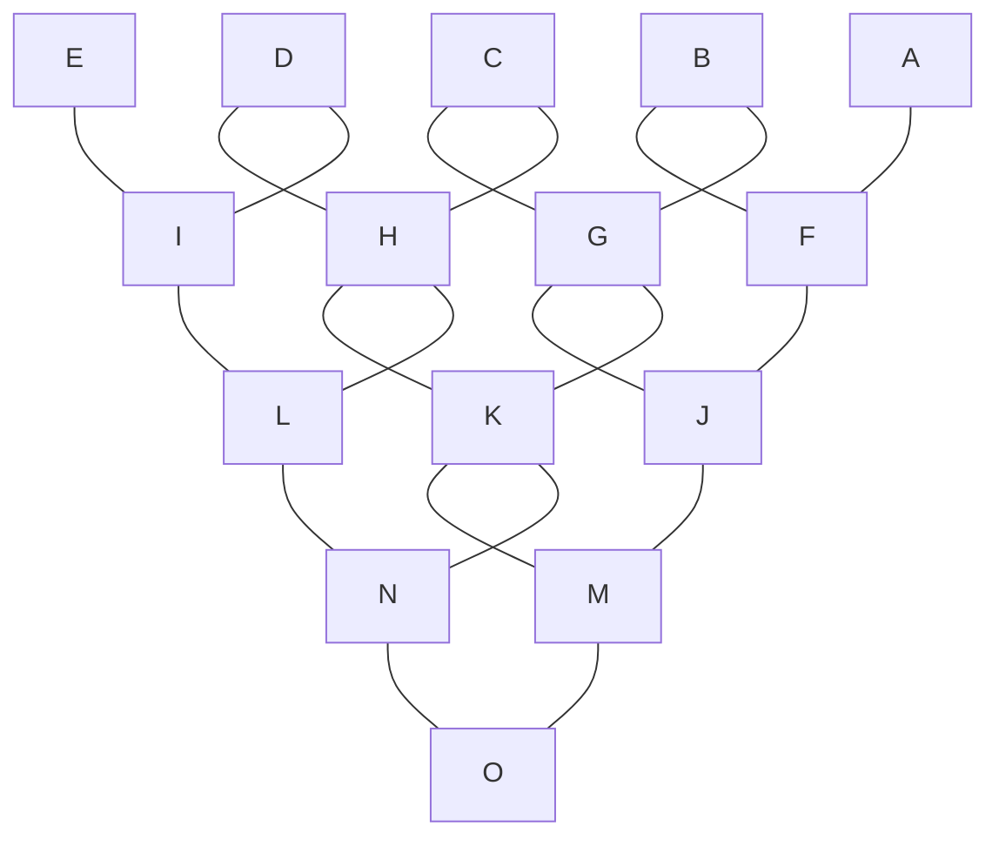

# Operacijske raziskave - vaje 30.3.2020

---

## Dinamično programiranje


* Deli in vladaj



* Dinamično programiranje



---

### Naloga 1

Na avtocestni odsek dolžine <i>$M$</i> kilometrov želimo postaviti oglasne plakate. Dovoljene lokacije plakatov določa urad za oglaševanje in so predstavljene s števili <i>$x_1, x_2, \dots x_n$</i>, kjer <i>$x_i$</i> (<i>$1 \le i \le n$</i>) predstavlja oddaljenost od začetka odseka v kilometrih. Profitabilnost oglasa na lokaciji <i>$x_i$</i> določa vrednost <i>$v_i$</i> (<i>$1 \le i \le n$</i>). Urad za oglaševanje podaja tudi omejitev, da mora biti razdalja med oglasi vsaj <i>$d$</i> kilometrov. Oglase želimo postaviti tako, da bodo čim bolj profitabilni.

1. Reši problem za parametre <i>$M = 20$</i>, <i>$d = 5$</i>, <i>$n = 8$</i>, <i>$(x_i)_{i=1}^n = (1, 2, 8, 10, 12, 14, 17, 20)$</i> in <i>$(v_i)_{i=1}^n = (8, 8, 12, 10, 7, 5, 6, 10)$</i>.
2. Napiši rekurzivne enačbe za opisani problem.
3. Napiši algoritem, ki poišče najbolj profitabilno postavitev oglasov za dane parametre. Kakšna je njegova časovna zahtevnost?

----

| <i>$i$</i> | 1 | 2 | 3 | 4 | 5 | 6 | 7 | 8 |
| --- | - | - | - | - | - | - | - | - |
| <i>$x_i$</i> | 1 | 2 | 8 | 10 | 12 | 14 | 17 | 20 |
| <i>$v_i$</i> | 8 | 8 | 12 | 10 | 7 | 5 | 6 | 10 |
| <i>$p_i$</i> | 8 | 8 | 20 | 20 | 20 | 25 | 26 | 35 |
| <i>$y_i$</i> | 0 | | 2 | | | 3 | 5 | 6 |

Kam postavimo plakate: <i>$x_8 = 20, x_6 = 14, x_3 = 8, x_1 = 1$</i>.

$$
\begin{aligned}
y_0 &= 0 \\
p_0 &= 0 \\
y_i &= \max\{j \mid y_{i-1} \le j \le i-1, x_j \le x_i - d\} & (i > 0) \\
p_i &= \max\{p_{i-1}, v_i + p_{y_i}\} & (i > 0) \\
p^* &= p_n
\end{aligned}
$$

----

```python
def plakati(x, v, d):
    n = len(x)
    j = 0
    s = []
    for i, xi in enumerate(x):
        while xi - x[j] >= d:
            j += 1
        if j == 0:
            p = 0
            y = None
        else:
            y = j - 1
            p = s[y][0]
        p += v[i]
        if i > 0 and p < s[i-1][0]:
            y = i - 1
            p = s[y][0]
            b = False
        else:
            b = True
        s.append((p, y, b))
    p, y, b = s[-1]
    pozicije = []
    if b:
        pozicije.append(n - 1)
    while y is not None:
        z = y
        _, y, b = s[y]
        if b:
            pozicije.append(z)
    return (p, list(reversed(pozicije)))
```

Časovna zahtevnost: <i>$O(n)$</i>

---

### Naloga 2

Imamo nahrbtnik nosilnosti <i>$M$</i> kilogramov. Danih je <i>$n$</i> objektov z vrednostmi <i>$v_i$</i> in težami <i>$t_i$</i> (<i>$1 \le i \le n$</i>). Problem nahrbtnika sprašuje po izbiri predmetov <i>$I \subseteq \{1, 2, \dots, n\}$</i>, ki maksimizira njihovo skupno vrednost pri omejitvi <i>$\sum_{i \in I} t_i \le M$</i>.

1. Napiši rekurzivne enačbe za opisani problem.
2. Z uporabo rekurzivnih enačb reši problem za parametre <i>$M = 8$</i>, <i>$n = 8$</i>, <i>$(v_i)_{i=1}^n = (9, 9, 8, 11, 10, 15, 3, 12)$</i> in <i>$(t_i)_{i=1}^n = (3, 5, 1, 4, 3, 8, 2, 7)$</i>.

----

$$
\begin{aligned}
(p_0, I_0) &= (0, \emptyset) \\
(p_j, I_j) &= \max(\{(p_{j-t_i} + v_i, I_{j-t_i} \cup \{i\}) \mid 1 \le i \le n, t_i \le j, i \not\in I_{j-t_i}\} \cup \{(p_{j-1}, I_{j-1})\}) & (j > 0) \\
(p^*, I^*) &= (p_M, I_M)
\end{aligned}
$$

| <i>$j$</i> | <i>$p_j$</i> | <i>$I_j$</i> |
| --- | ----- | ----- |
| 0 | 0 | <i>$\emptyset$</i> |
| 1 | 8 | <i>$\{3\}$</i> |
| 2 | 8 | <i>$\{3\}$</i> |
| 3 | 11 | <i>$\{3, 7\}$</i> |
| 4 | 18 | <i>$\{3, 5\}$</i> |
| 5 | 19 | <i>$\{3, 4\}$</i> |
| 6 | 21 | <i>$\{3, 5, 7\}$</i> |
| 7 | 27 | <i>$\{1, 3, 5\}$</i> |
| 8 | 29 | <i>$\{3, 4, 5\}$</i> |

<i>$p^* = 29$</i>, <i>$I^* = \{3, 4, 5\}$</i>

Časovna zahtevnost: <i>$O(Mn)$</i> - psevdopolinomska!

---

### Naloga 3

Dana je matrika <i>$A = (a_{ij})_{i,j=1}^{m,n}$</i>. Poiskati želimo pot minimalne vsote, ki se začne v levem zgornjem kotu (pri <i>$a_{11}$</i>) in konča v desnem spodnjem kotu (pri <i>$a_{mn}$</i>). Dovoljeni so zgolj premiki v desno in navzdol.

1. Reši problem za matriko

   $$
   A = \begin{pmatrix}
   131 & 673 & 234 & 103 &  18 \\
   201 &  96 & 342 & 965 & 150 \\
   630 & 803 & 746 & 422 & 111 \\
   537 & 699 & 497 & 121 & 956 \\
   805 & 732 & 524 &  37 & 332
   \end{pmatrix} .
   $$

2. Napiši rekurzivne enačbe za opisani problem.

3. Na osnovi rekurzivnih enačb napiši algoritem, ki reši opisani problem. Oceni tudi njegovo časovno zahtevnost v odvisnosti od <i>$m$</i> in <i>$n$</i>.

----

$$
\begin{aligned}
p_{11} &= a_{11} \\
p_{1j} &= a_{1j} + p_{1, j-1} & (j > 1) \\
p_{i1} &= a_{i1} + p_{i-1, 1} & (i > 1) \\
p_{ij} &= a_{ij} + \min\{p_{i-1, j}, p_{i, j-1}\} & (i, j > 1) \\
p^* &= p_{mn}
\end{aligned}
$$

$$
\newcommand{\l}{\leftarrow}
\newcommand{\g}{\uparrow}
P = \begin{pmatrix}
131 & \l 804 & \l 1038 & \l 1141 & \l 1159 \\
\g 332 & \l 428 & \l 770 & \l 1735 & \g 1309 \\
\g 962 & \g 1231 & \g 1516 & \l 1938 & \g 1420 \\
\g 1499 & \g 1930 & \g 2013 & \g 2059 & \g 2376 \\
\g 2304 & \g 2662 & \g 2537 & \g 2096 & \l 2428
\end{pmatrix} .
$$

Časovna zahtevnost: <i>$O(mn)$</i>
