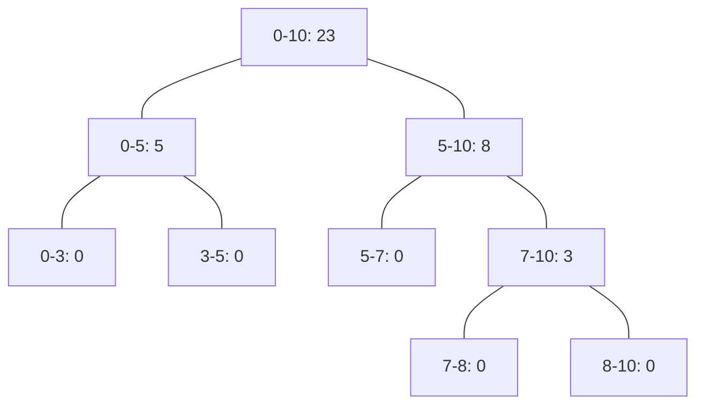

# Operacijske raziskave - vaje 6.4.2020

---

## Dinamično programiranje

### Naloga 1

Dan je niz <i>$S = a_1 a_2 \dots a_n$</i>, kjer so <i>$a_i$</i> (<i>$1 \le i \le n$</i>) elementi neke končne abecede. Nizu <i>$a_j a_{j+1} \dots a_k$</i>, kjer je <i>$1 \le j \le k \le n$</i>, pravimo *strnjen podniz* niza <i>$S$</i>. S pomočjo dinamičnega programiranja napiši algoritem, ki določi najdaljši palindromski strnjen podniz v <i>$S$</i>.

----

$$
\begin{aligned}
p_{ij} &\dots \text{ali je strnjen podniz $a_i \dots a_{j-1}$ palindrom} \\[1ex]
p_{ii} &= \top \\
p_{i,i+1} &= \top \\
p_{ij} &= (a_i = a_{j-1}) \land p_{i+1, j-1} \quad (j > i+1) \\
(\ell^*, i^*, j^*) &= \max\{(j-i, i, j) \mid 1 \le i \le j \le n, p_{ij} = \top\}
\end{aligned}
$$


Vrstni red računanja: naraščajoče po <i>$j-i$</i>, <i>$i$</i>

```python
def palindrom(s):
    n = len(s)
    if n == 0: # prazen niz je palindrom
        return (0, 0, 0)
    p = {}
    for i in range(n):
        p[i, i] = True
    for i in range(n-1):
        p[i, i+1] = True
    d = [True, True]
    ll, ii, jj = 1, n-1, n
    for l in range(2, n+1):
        if not (d[l-2] or d[l-1]):  # če ni bilo palindromov
            break           # prejšnjih dveh dolžin, končamo
        d.append(False)
        for i in range(n-l+1):
            p[i, i+l] = (s[i] == s[i+l-1]) and p[i+1, i+l-1]
            if p[i, i+l]:      # imamo palindrom, zabeležimo
                d[l] = True
                ll, ii, jj = l, i, i+l
    return ll, ii, jj
```

Časovna zahtevnost: <i>$O(n^2)$</i>

---

### Naloga 2

Dana je matrika <i>$A = (a_{ij})_{i,j=1}^{m,n}$</i>. Poiskati želimo strnjeno podmatriko matrike <i>$A$</i> z največjo vsoto komponent.

1. Reši problem za matriko

   $$
   A = \begin{pmatrix}
    1 & -1 &  2 &  4 \\
   -3 & -2 &  8 &  2 \\
   -3 &  2 & -2 &  4 \\
    1 & -5 & -1 & -2
   \end{pmatrix} .
   $$

2. Napiši rekurzivne enačbe za opisani problem.

3. Napiši algoritem, ki reši opisani problem. Oceni tudi njegovo časovno zahtevnost v odvisnosti od <i>$m$</i> in <i>$n$</i>.

----

$$
\begin{aligned}
v_{hij} &\dots \text{največja vsota elementov od vrstic $h+1$ do $i$ z zadnjim stolpcem $j$} \\
c_{hij} &\dots \text{vsota števil od vrstic $h+1$ do $i$ v $j$-tem stolpcu} \\
s_{ij} &\dots \text{vsota števil do $i$-te vrstice v $j$-tem stolpcu} \\[1ex]
s_{0j} &= 0 \\
s_{ij} &= s_{i-1, j} + a_{ij} \quad (i > 0) \\[1ex]
c_{hij} &= s_{ij} - s_{hj} \\[1ex]
v_{hi0} &= 0 \\
v_{hij} &= s_{ij} - s_{hj} + \max\{v_{h,i,j-1}, 0\} \\[1ex]
v^* &= \max\{v_{hij} \mid 0 \le h \le i \le m, 0 \le j \le n\}
\end{aligned}
$$

Vrstni red računanja: <i>$s_{ij}$</i> naraščajoče po <i>$i$</i>, <i>$j$</i>; <i>$v_{hij}$</i> naraščajoče po <i>$h \le i$</i>, <i>$j$</i>

Časovna zahtevnost: <i>$O(mn) + O(m^2 n) = O(m^2 n)$</i>

---

### Naloga 3

Na ulici je <i>$n$</i> vrstnih hiš, pri čemer je v <i>$i$</i>-ti hiši <i>$c_i$</i> denarja. Tat se odloča, katere izmed hiš naj oropa. Vsak oropan stanovalec to sporoči svojim sosedom, zato tat ne sme oropati dveh sosednjih hiš. Ker je tat poslušal predmet Operacijske raziskave, pozna dinamično programiranje. Pokaži, kako naj tat določi, katere hiše naj oropa.

$$
\begin{aligned}
v_i &\dots \text{max vrednost do $i$-te hiše} \\[1ex]
v_0 &= 0 \\
v_1 &= c_1 \\
v_i &= \max\{c_i + v_{i-2}, v_{i-1}\} \quad (i > 1) \\[1ex]
v^* &= v_n
\end{aligned}
$$

Vrstni red računanja: naraščajoče po <i>$i$</i>

Časovna zahtevnost: <i>$O(n)$</i>

---

### Naloga 4

Imamo hlod dolžine <i>$\ell$</i>, ki bi ga radi razžagali na <i>$n$</i> označenih mestih <i>$0 < x_1 < x_2 < \dots < x_n < \ell$</i>. Eno rezanje stane toliko, kolikor je dolžina hloda, ki ga režemo. Ko hlod prerežemo, dobimo dva manjša hloda, ki ju režemo naprej. Poiskati želimo zaporedje rezanj z najmanjšo ceno.

1. Reši problem pri podatkih <i>$\ell = 10$</i> in <i>$(x)_{i=1}^4 = (3, 5, 7, 8)$</i>.
2. S pomočjo dinamičnega programiranja reši problem v splošnem. Oceni tudi njegovo časovno zahtevnost.

$$
\begin{aligned}
x_0 &= 0 \\
x_{n+1} &= \ell \\[1ex]
c_{ij} &\dots \text{optimalna cena rezanja hloda od $x_i$ do $x_j$} \\[1ex]
c_{i, i+1} &= 0 \\
c_{ij} &= x_j - x_i + \min\{c_{ih} + c_{hj} \mid i+1 \le h \le j-1\} \quad (j > i+1) \\[1ex]
c^* &= c_{0, n+1}
\end{aligned}
$$

Vrstni red: <i>$c_{ij}$</i> naraščajoče po <i>$j-i$</i>, <i>$i$</i>

Časovna zahtevnost: <i>$O(n^3)$</i>

$$
\begin{alignedat}{3}
c_{01} &= c_{12} = c_{23} = c_{34} = c_{45} = 0 \\[1ex]
c_{02} &= 5 \\
c_{13} &= 4 \\
c_{24} &= 3 \\
c_{35} &= 3 \\[1ex]
c_{03} &= 7 + \min\{4, 5\} &&= 11 &&\quad \text{režemo na $x_1$} \\
c_{14} &= 5 + \min\{3, 4\} &&= 8 &&\quad \text{režemo na $x_2$} \\
c_{25} &= 5 + \min\{3, 3\} &&= 8 \\[1ex]
c_{04} &= 8 + \min\{8, 5+3, 11\} &&= 16 &&\quad \text{režemo na $x_1$ ali $x_2$} \\
c_{15} &= 7 + \min\{8, 4+3, 8\} &&= 14 &&\quad \text{režemo na $x_3$} \\[1ex]
c_{05} &= 10 + \min\{14, 5+8, 11+3, 16\} &&= 23 &&\quad \text{režemo na $x_2$}
\end{alignedat}
$$

Optimalno rezanje:



---

### Naloga 5

Na voljo imamo kovance z vrednostmi <i>$1 = v_1 < v_2 < \cdots < v_n$</i> in vsoto <i>$C$</i>, ki jo želimo izplačati s kovanci. Predpostavljamo, da imamo dovolj velik nabor kovancev.

1. Poišči izplačilo z najmanjšim številom kovancev
za <i>$C = 25$</i>, <i>$n = 4$</i> in <i>$(v_i)_{i=1}^n = (1, 2, 5, 7)$</i>.
2. S pomočjo dinamičnega programiranja reši problem v splošnem.

---

### Naloga 6

Imamo zaporedje <i>$n$</i> polj, pri čemer je na <i>$i$</i>-tem polju zapisano število <i>$a_i$</i>. Na voljo imamo še <i>$\lfloor n/2 \rfloor$</i> domin, z vsako od katerih lahko pokrijemo dve sosednji polji. Vsaka domina je sestavljena iz dveh delov: na enem je znak <i>$+$</i>, na drugem pa znak <i>$-$</i>. Posamezno polje lahko pokrijemo z le eno domino; če sta pokriti dve sosednji polji, morata biti pokriti z različnima znakoma (bodisi z iste, bodisi z druge domine). Iščemo tako postavitev domin, ki maksimizira vsoto pokritih števil, pomnoženih z znakom na delu domine, ki pokriva število. Pri tem ni potrebno, da uporabimo vse domine.

----

**Primer** dopustnega (ne nujno optimalnega) pokritja:

|    | [+ | -] |    |    | [- | +] | [- | +] |
| -- | -- | -- | -- | -- | -- | -- | -- | -- |
|  6 |  3 | -4 |  2 | -3 |  5 |  9 |  1 |  2 |

Vsota tega pokritja je <i>$3 - (-4) - 5 + 9 - 1 + 2 = 12$</i>. Če bi eno od zadnjih dveh domin obrnili (zamenjala bi se znaka), dobljeno pokritje ne bi bilo dopustno, saj bi dve zaporedni polji bili pokriti z enakima znakoma.

----

1. Zapiši rekurzivne enačbe za reševanje danega problema. Razloži, kaj predstavljajo spremenljivke, v kakšnem vrstnem redu jih računamo, ter kako dobimo optimalno rešitev.

   **Namig:** posebej obravnavaj dva primera glede na postavitev zadnje domine.

2. Oceni časovno zahtevnost algoritma, ki sledi iz zgoraj zapisanih enačb.

3. S svojim algoritmom poišči optimalno pokritje za zgornji primer.
