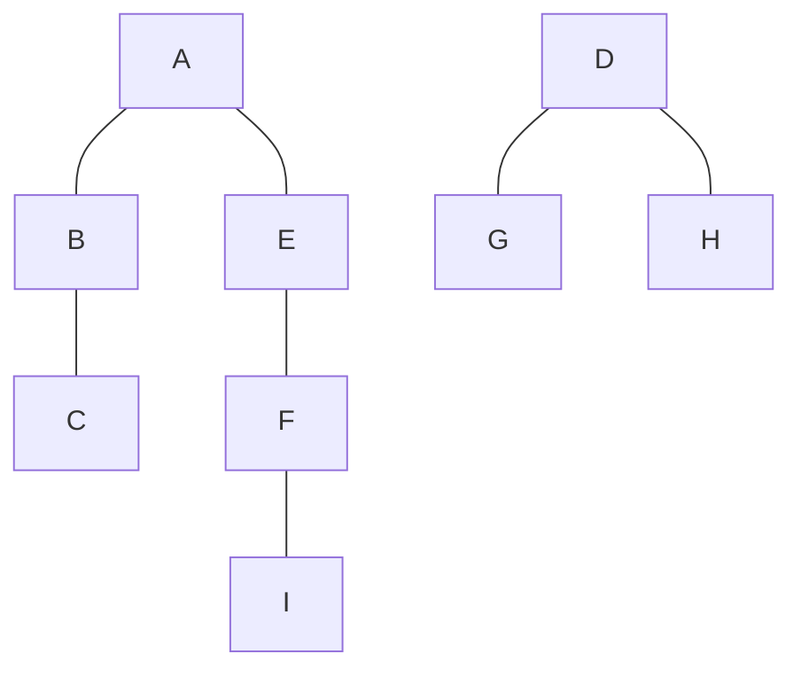
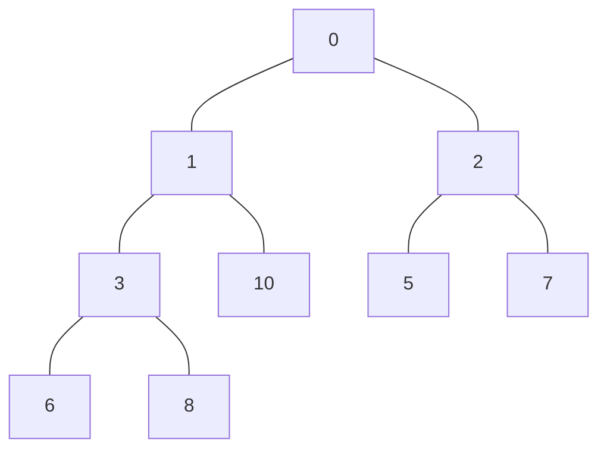
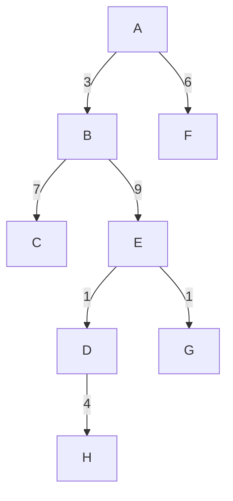
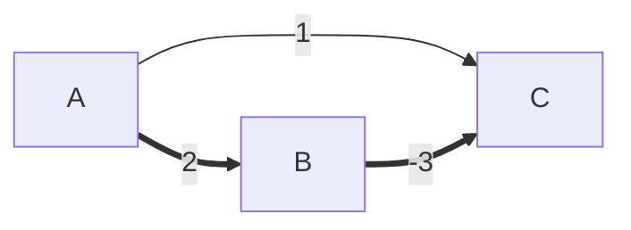
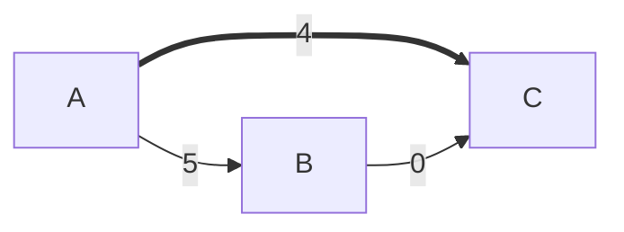

# Operacijske raziskave - vaje 4.5.2020

---

## Iskanje v širino

```python
class Graf:
    ...

    def BFS(G, visit=None, koreni=None):
        globina = {}
        stars = {}
        if visit is None:
            def visit(u, v):
                pass
        if koreni is None:
            koreni = G.vozlisca()
        for w in koreni:
            if w in globina:
                continue
            nivo = [w]
            globina[w] = 0
            stars[w] = None
            i = 1
            while len(nivo) > 0:
                naslednji = []
                for u in nivo:
                    visit(u, stars[u])
                    for v in G.sosedi(u):
                        if v not in globina:
                            globina[v] = i
                            stars[v] = u
                            naslednji.append(v)
                nivo = naslednji
                i += 1
        for u in G.vozlisca():
            if u not in globina:
                globina[u] = float('inf')
                stars[u] = None
        return (globina, stars)
```

Časovna zahtevnost: $O(m) + O(n)$ klicev funkcije `visit`

---

### Naloga 1

Na sledečem grafu izvedi iskanje v širino. V primerih, ko imaš več enakovrednih izbir, upoštevaj abecedni vrstni red. Za vsako povezavo določi, ali se nahaja v drevesu iskanja v širino.


----

|         | A | B | C | D | E | F | G | H | I |
| ------- | - | - | - | - | - | - | - | - | - |
| globina | 0 | 1 | 2 | 0 | 1 | 2 | 1 | 1 | 3 |
| stars   | / | A | B | / | A | E | D | D | F |

0. nivo: A
1. nivo: B, E
2. nivo: C, F
3. nivo: I

----

0. nivo: D
1. nivo: G, H



---

### Naloga 2

Zapiši algoritem, ki za vhodni graf <i>$G$</i> določi njegov premer.

----

```python
class Graf:
    ...

    def premer(G):
        return max(x for u in G.vozlisca()
            for x in G.BFS(koreni=[u])[0].values())
```

Časovna zahtevnost: $O(mn)$

---

## Dijkstrov algoritem

```python
class UtezenDigraf(Digraf):
    ...

    def utezeniSosedi(G, u):
        """
        Vrne slovar uteži povezav
        od u do vsakega njegovega soseda.
        """
        ...

    def dijkstra(G, koren):
        Q = PrednostnaVrsta({v: 0 if v == koren
                                else float('inf')
                             for v in G.vozlisca()})
        razdalja = {}
        stars = {koren: None}
        while len(Q) > 0:
            v, d = Q.pop() # vozlišče z najmanjšo razdaljo v vrsti odstranimo iz vrste
            razdalje[v] = d
            for w, t in G.utezeniSosedi(v).items():
                if w in razdalje:
                    continue
                r = d + t
                if r < Q[w]:
                    Q[w] = r
                    stars[w] = v
        return (razdalje, stars)
```

Časovna zahtevnost:
* s slovarjem: $O(n^2)$
* s kopico: $O(m \log n)$

Kopica:


---

### Naloga 3

S pomočjo Dijkstrovega algoritma določi razdalje od vozlišča <i>$A$</i> do ostalih vozlišč.


----

|          | A | B | C  | D  | E  | F | G  | H  |
| -------- | - | - | -- | -- | -- | - | -- | -- |
| vrsta    |   |   |    |    |    |   |    |    |
| razdalja | 0 | 3 | 10 | 13 | 12 | 6 | 13 | 17 |
| stars    | / | A | B  | E  | B  | A | E  | D  |



---

### Naloga 4

Naj bo $G = (V, E)$ graf, za katerega so dolžine povezav določene s funkcijo $\ell : E \to \mathbb{R}$ (tj., dolžine so lahko tudi negativne). Definirajmo še funkcijo $\ell' : E \to \mathbb{R}$ tako, da velja $\ell'(e) = \ell(e) - \min\{\ell(f) \mid f \in E\}$ (dolžine, določene z $\ell'$, so torej nenegativne). 

Dokaži ali ovrzi: drevo najkrajših poti, ki ga Dijkstrov algoritem ustvari ob vhodu $(G, \ell')$, je tudi drevo najkrajših poti za graf <i>$G$</i> z dolžinami povezav, določenimi z $\ell$.

----





---

### Naloga 5

Denimo, da imamo neusmerjen graf $G = (V, E)$, katerega vozlišča predstavljajo mesta, povezave pa predstavljajo ceste, ki jih povezujejo. Za vsako povezavo $e \in E$ poznamo njeno dolžino $\ell_e$ (v kilometrih).

Priti želimo iz mesta <i>$s$</i> v mesto <i>$t$</i>. V vsakem mestu je bencinska črpalka, ob cestah pa teh ni. Žal imamo na voljo samo star avto, ki lahko s polnim rezervoarjem prepelje le <i>$L$</i> kilometrov.

1. Zapiši algoritem, ki v linearnem času poišče pot, ki jo lahko prevozimo z našim avtom, oziroma ugotovi, da ta ne obstaja.

2. Izkaže se, da z našim avtom te poti ne moremo prevoziti, zato se odločimo za nakup novega. Zapiši algoritem, ki v času $O(m \log n)$ določi najmanjše število prevoženih kilometrov, ki naj jih avto zmore z enim polnjenjem, da bo pot od <i>$s$</i> do <i>$t$</i> mogoča.

---

### Naloga 6

Zasnuj različico Dijkstrovega algoritma za iskanje najkrajše poti med vozliščema <i>$s$</i> in <i>$t$</i> v grafu <i>$G$</i>, ki iskanje hkrati začne v vozliščih <i>$s$</i> in <i>$t$</i>. Kdaj naj se iskanje konča in kako naj se poišče rešitev?
