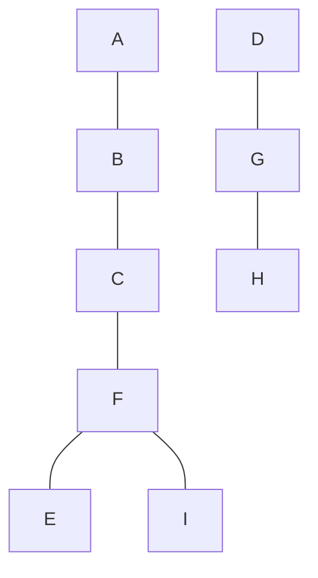
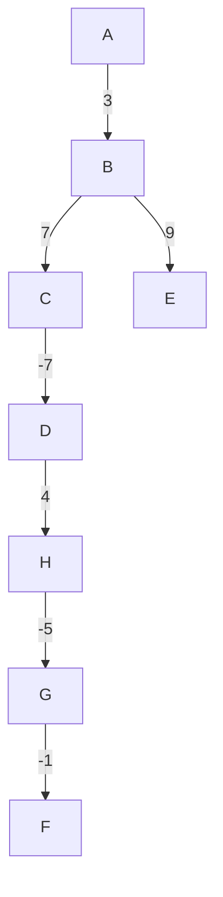

# Operacijske raziskave - vaje 11.5.2020

---

## Iskanje v globino

```python
class Graf:
    ...

    def DFS(G, previsit=None, postvisit=None, koreni=None):
        def nothing(u, v):
            pass
        if previsit is None:
            previsit = nothing
        if postvisit is None:
            postvisit = nothing
        if koreni is None:
            koreni = G.vozlisca()
        globina = {}
        stars = {}
        def obisci(u, v):
            if u in globina:
                return
            globina[u] = globina[v] + 1 if v is not None else 0
            stars[u] = v
            previsit(u, v)
            for w in G.sosedi(u):
                obisci(w, u)
            postvisit(u, v)
        for w in koreni:
            obisci(w, None)
        for u in G.vozlisca():
            if u not in globina:
                globina[u] = float('inf')
                stars[u] = None
        return (globina, stars)
```

Časovna zahtevnost: $O(m) + O(n)$ klicev `previsit` in `postvisit`

---

### Naloga 1

Na sledečem grafu izvedi iskanje v globino. V primerih, ko imaš več enakovrednih izbir, upoštevaj abecedni vrstni red. Za vsako povezavo določi, ali se nahaja v drevesu iskanja v globino.


----

| vozlišče  | A | B | C | D | E | F | G | H | I |
| --------- | - | - | - | - | - | - | - | - | - |
| globina   | 0 | 1 | 2 | 0 | 4 | 3 | 1 | 2 | 4 |
| stars     | - | A | B | - | F | C | D | G | F |
| preorder  | 1 | 2 | 3 | 7 | 5 | 4 | 8 | 9 | 6 |
| postorder | 6 | 5 | 4 | 9 | 1 | 3 | 8 | 7 | 2 |


 
---

## Bellman-Fordov algoritem

```python
class UtezenDigraf(Digraf):
    ...

    def bellmanFord(G, koren):
        razdalje = {v: 0 if v == koren else float('inf')
                    for v in G.vozlisca()}
        stars = {koren: None}
        naslednji = {koren}
        for i in range(len(G)):
            if len(naslednji) == 0:
                break
            trenutni, naslednji = naslednji, set()
            for v in trenutni:
                d = razdalje[v]
                for w, r in G.utezeniSosedi(v).items():
                    r += d
                    if r < razdalje[w]:
                        razdalje[w] = r
                        stars[w] = v
                        naslednji.add(w)
        else: # če se for zanka ne konča z break
            if len(naslednji) > 0:
                raise ValueError("graf ima negativen cikel")
        return (razdalje, stars)
```

Časovna zahtevnost: $O(mn)$

---

### Naloga 2

S pomočjo Bellman-Fordovega algoritma določi razdalje od vozlišča $A$ do ostalih vozlišč.


----

| vozlišče  | A | B | C  | D | E  | F | G  | H |
| --------- | - | - | -- | - | -- | - | -- | - |
| razdalje  | 0 | 3 | 10 | 3 | 12 | 1 | 2  | 7 |
| stars     | - | A | B  | C | B  | G | H  | D |
| korak 1   | * |   |    |   |    |   |    |   |
| korak 2   |   | * |    |   |    | * |    |   |
| korak 3   |   |   | *  |   | *  |   | *  |   |
| korak 4   |   |   |    | * |    |   | *  |   |
| korak 5   |   |   |    |   |    |   |    | * |
| korak 6   |   |   |    |   |    |   | *  |   |
| korak 7   |   |   |    |   |    | * |    |   |
| korak 8   |   |   |    |   |    |   |    |   |



---

## Topološko urejanje

```python
class Digraf(Graf):
    ...

    def topoloskoUrejanje(G):
        stopnje = {u: len(G.vhodniSosedi(u)) for u in G.vozlisca()}
        vrsta = {u for u, s in stopnje.items() if s == 0}
        urejanje = []
        while len(vrsta) != 0:
            u = vrsta.pop()
            urejanje.append(u)
            for v in G.izhodniSosedi(u):
                stopnje[v] -= 1
                if stopnje[v] == 0:
                    vrsta.append(v)
        return urejanje
```

Časovna zahtevnost: $O(m)$

---

### Naloga 3

Dan je sledeči usmerjen acikličen graf.


1. Poišči topološko ureditev vozlišč zgornjega grafa.
2. Poišči najkrajšo pot od vozlišča $G$ do vozlišča $E$.
3. Poišči najdaljšo pot od vozlišča $G$ do vozlišča $E$.

----

1. | vozlišče | A | B | C | D | E | F | G | H |
   | -------- | - | - | - | - | - | - | - | - |
   | stopnje  | - | - | - | - | - | - | - | - |

   Topološka ureditev: G, A, H, B, C, D, F, E

2. | vozlišče | G | A  | H  | B | C  | D  | F | E  |
   | -------- | - | -- | -- | - | -- | -- | - | -- |
   | razdalja | 0 | -1 | -1 | 1 | -3 | -1 | 3 | -1 |
   | stars    | - | G  | A  | A | A  | C  | C | B  |

   ```mermaid
   graph TD

   G -- -1 --> A
   A -- 2 --> B
   A -- -2 --> C
   A -- 0 --> H
   B -- -2 --> E
   C -- 2 --> D
   C -- 6 --> F
   ```

   Časovna zahtevnost: $O(m)$

---

### Naloga 4

Oviratlon je tekalna preizkušnja na 8 do 10 kilometrov dolgi poti z različnimi ovirami. Zanima nas, na koliko različnih načinov lahko pridemo od štarta do cilja. Dan je utežen usmerjen acikličen graf $G$ ter vozlišči $s$ in $t$, ki predstavljata štart oziroma cilj. Uteži na povezavah nam predstavljajo, na koliko načinov jih lahko prečkamo.

1. Reši nalogo za sledeči graf.

   

2. Zapiši algoritem, ki reši dani problem. Kakšna je njegova časovna zahtevnost?
