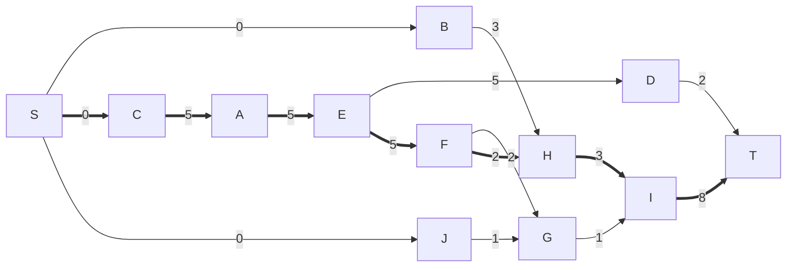
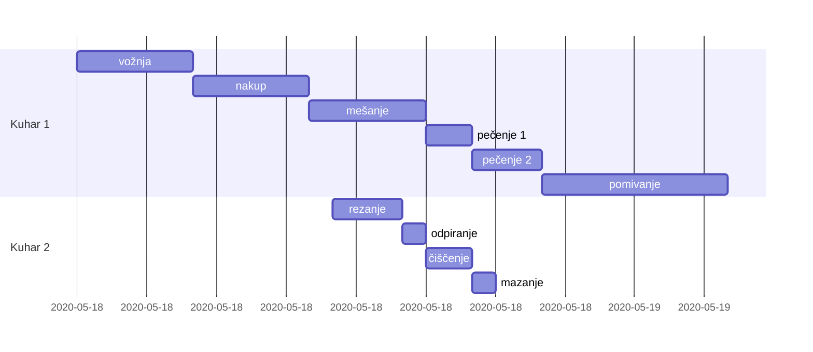
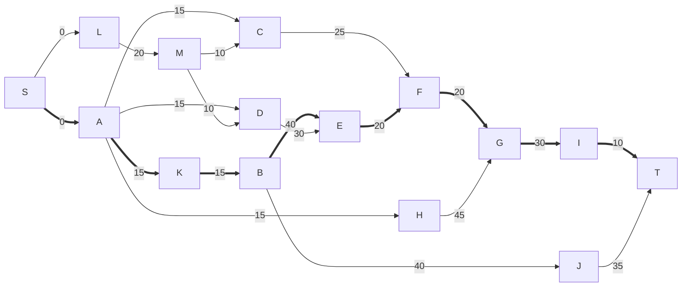

# Operacijske raziskave - vaje 18.5.2020

---

## Načrtovanje projektov - metoda kritične poti (CPM)

### Naloga 1

Dinamika priprave dveh palačink z dvema kuharjema je naslednja:

| faza | aktivnost | trajanje | predhodna opravila |
| ---- | --------- | -------- | ------------------ |
| A | nakup moke, jajc in mleka | 5 min | C |
| B | rezanje sira | 3 min | / |
| C | vožnja do trgovine | 5 min | / |
| D | čiščenje mešalnika | 2 min | E |
| E | mešanje sestavin | 5 min | A |
| F | pečenje prve palačinke | 2 min | E |
| G | mazanje prve palačinke z marmelado | 1 min | F, J |
| H | pečenje palačinke (s sirom) | 3 min | B, F |
| I | pomivanje posode | 8 min | G, H |
| J | odpiranje marmelade | 1 min | / |

1. Topološko uredi ustrezni graf in ga nariši.
2. Določi kritična opravila in kritično pot ter trajanje priprave.
3. Katero opravilo je najmanj kritično?
4. Določi razpored opravil, pri čemer en kuhar prevzame opravila na kritični poti, drugi pa naj čim kasneje začne in čim prej konča.

----

Topološka ureditev: S, B, C, J, A, E, D, F, G, H, I, T

* Skupne rezerve (razlika): max začetek naslednikov - min konec predhodnikov - trajanje
* Proste rezerve: min začetek naslednikov - min konec predhodnikov - trajanje
* Varnostne rezerve: max začetek naslednikov - max konec predhodnikov - trajanje
* Neodvisne rezerve: min začetek naslednikov - max konec predhodnikov - trajanje

| vozlišče | S | B | C | J | A | E | D | F | G | H | I | T |
| -------- | - | - | - | - | - | - | - | - | - | - | - | - |
| min začetek | 0 | 0/S | 0/S | 0/S | 5/C | 10/A | 15/E | 15/E | 17/F | 17/F | 20/H | 28/I |
| max začetek | 0/C | 14/H | 0/A | 18/G | 5/A | 10/F | 26/T | 15/H | 19/I | 17/I | 20/T | 28 |
| razlika | 0 | 14 | 0 | 18 | 0 | 0 | 11 | 0 | 2 | 0 | 0 | 0 |
| proste rezerve | 0 | 14 | 0 | 16 | 0 | 0 | 11 | 0 | 2 | 0 | 0 | 0 |
| varnostne rezerve | 0 | 14 | 0 | 18 | 0 | 0 | 11 | 0 | 0 | 0 | 0 | 0 |
| neodvisne rezerve | 0 | 14 | 0 | 16 | 0 | 0 | 11 | 0 | 0 | 0 | 0 | 0 |

* Kritična opravila: C, A, E, F, H, I
* Kritična pot: S - C - A - E - F - H - I - T
* Najmanj kritično opravilo: J

---

### Naloga 2

Izdelati želimo terminski plan za izdelavo spletne aplikacije. V spodnji tabeli so zbrana opravila pri izdelavi.

| opravilo | opis | trajanje | pogoji |
| -------- | ---- | -------- | ------ |
| A | natančna opredelitev funkcionalnosti | 15 dni | / |
| B | programiranje uporabniškega vmesnika | 40 dni | K |
| C | programiranje skrbniškega vmesnika | 25 dni | A, M |
| D | programiranje strežniškega dela | 30 dni | A, M |
| E | integracija uporabniškega vmesnika s strežnikom | 20 dni | B, D |
| F | alfa testiranje | 20 dni | C, E |
| G | beta testiranje | 30 dni | F, H |
| H | pridobivanje testnih uporabnikov | 45 dni | A |
| I | vnos zadnjih popravkov | 10 dni | G |
| J | izdelava uporabniške dokumentacije | 35 dni | B |
| K | dizajniranje uporabniškega vmesnika | 15 dni | A |
| L | nabava računalniške opreme | 20 dni | / |
| M | postavitev strežnikov | 10 dni | L |

1. Topološko uredi ustrezni graf in ga nariši.
2. Določi kritična opravila in kritično pot ter čas izdelave.
3. Katero opravilo je najmanj kritično? Najmanj kritično je opravilo, katerega trajanje lahko najbolj podaljšamo, ne da bi vplivali na trajanje izdelave.

----

Topološka ureditev: S, A, L, H, K, M, B, C, D, E, J, F, G, I, T

opravilo | S | A | L | H | K | M | B | C | D | E | J | F | G | I | T |
-------- | - | - | - | - | - | - | - | - | - | - | - | - | - | - | - |
min začetek | 0 | 0/S | 0/S | 15/A | 15/A | 20/L | 30/K | 30/M | 30/M | 70/B | 70/B | 90/E | 110/F | 140/G | 150/I |
max začetek | 0/A | 0/K | 10/M | 65/G | 15/B | 30/D | 30/E | 65/F | 40/E | 70/F | 115/T | 90/G | 110/I | 140/T | 150 |
razlika | 0 | 0 | 10 | 50 | 0 | 10 | 0 | 35 | 10 | 0 | 45 | 0 | 0 | 0 | 0 |

* kritična opravila: A, K, B, E, F, G, I
* kritična pot: S - A - K - B - E - F - G - I - T
* najmanj kritično opravilo: H

---

### Naloga 3

Gradimo objekt in želimo narediti opravila iz spodnje tabele, za katera vemo tudi, katera druga opravila morajo biti predhodno izvedena.

| oznaka | aktivnost | trajanje | predhodna opravila |
| ------ | --------- | ------- | ------------------ |
| A | postavitev stebra 1 | 4 dni | / |
| B | postavitev stebra 2 | 3 dni | D |
| C | postavitev stebra 3 | 5 dni | H |
| D | postavitev stebra 4 | 6 dni | A, E |
| E | postavitev stene 1 | 4 dni | A, G |
| F | postavitev stene 2 | 2 dni | H, I |
| G | postavitev stene 3 | 2 dni | / |
| H | postavitev stene 4 | 1 dan | / |
| I | postavitev stene 5 | 6 dni | C |
| J | betoniranje plošče | 2 dni | C, E, F |

1. Opravila A-J določajo usmerjen acikličen graf, kjer so povezave določene s predhodnimi opravili. Nariši ta graf in ga topološko uredi (lahko ga že narišeš topološko urejenega).

2. Določi kritična opravila, kritično pot in trajanje gradnje.

3. Katero opravilo je najmanj kritično?
