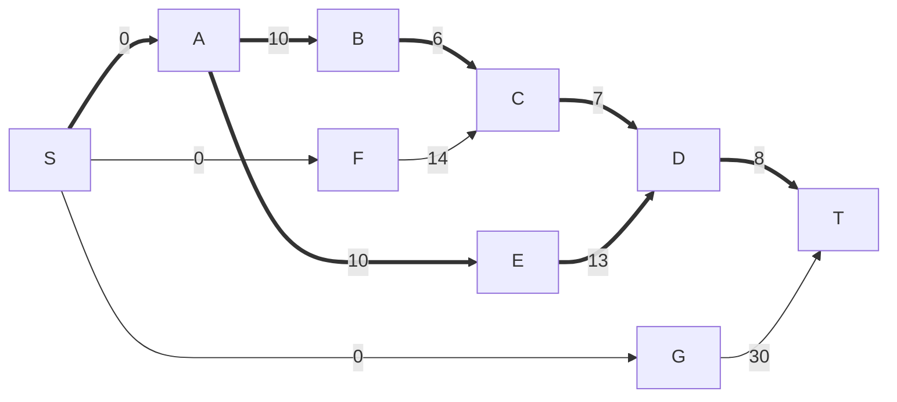
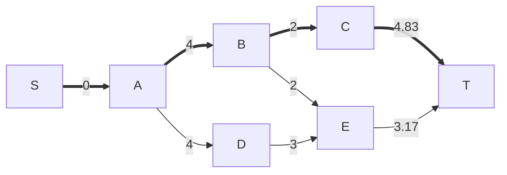
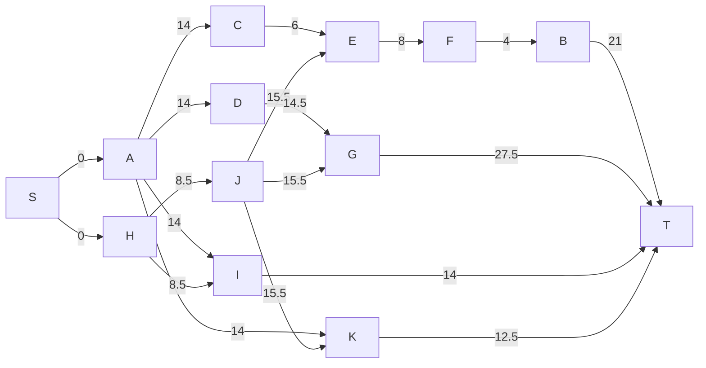

# Operacijske raziskave - vaje 25.5.2020

---

## Modeliranje z linearnim programom

### Naloga 1

Gradbinec in samooklicani arhitekt Brezzobec se je odločil, da bo postavil zelo posebno hišo. Gradnja bo imela sedem glavnih faz:

| faza | opis | trajanje | pogoj | min. trajanje | cena za dan manj |
| ---- | ---- | -------- | ----- | ------------- | ---------------- |
| A | gradnja kleti | 10 dni | / | 7 dni | 200 |
| B | gradnja pritličja | 6 dni | A | 5 dni | 100 |
| C | gradnja prvega nadstropja | 7 dni | B, F | 5 dni | 150 |
| D | gradnja strehe | 8 dni | C, E | 6 dni | 160 |
| E | gradnja desnega podpornega stebra | 13 dni | A | 9 dni | 250 |
| F | gradnja glavnega podpornega stebra | 14 dni | / | 11 dni | 240 |
| G | gradnja baročnega stolpa pred hišo | 30 dni | / | 25 dni | 300 |

1. Kdaj je lahko hiša najhitreje zgrajena? Katere faze so kritične?

2. Koliko je kritičnih poti in katere so?

3. Katero opravilo je najmanj kritično? Najmanj kritično je opravilo, katerega trajanje lahko največ podaljšamo, ne da bi vplivali na trajanje gradnje.

4. Brezzobčev brat je ponudil pomoč pri največ eni fazi gradnje. Slovi po tem, da pri fazi, pri kateri pomaga, zmanjša čas izvajanja za $10\%$. Pri kateri fazi naj pomaga, da bo čas gradnje čim krajši?

5. Brezzobčev bratranec ima podjetje, ki lahko pomaga pri gradnji, vendar za vsak dan krajšanja posamezne faze zahteva ustrezno plačilo (glej zadnja dva stolpca). Brezzobca zanima način, kako bi s čim manjšimi stroški čas gradnje zmanjšal na $27$ dni. Zapiši linearni program za ta problem.

----

Topološka ureditev: S, A, F, G, B, E, C, D, T

| opravilo | S | A | F | G | B | E | C | D | T |
| -------- | - | - | - | - | - | - | - | - | - |
| najprej  | 0 | 0/S | 0/S | 0/S | 10/A | 10/A | 16/B | 23/CE | 31/D |
| najkasneje | 0/A | 0/BE | 2/C | 1/T | 10/C | 10/D | 16/D | 23/T | 31 |
| razlike | 0 | 0 | 2 | 1 | 0 | 0 | 0 | 0 | 0 |

* Kritična opravila: A, B, E, C, D
* Kritična pot 1: S - A - B - C - D - T
* Kritična pot 2: S - A - E - D - T
* Krajšati se nam izplača opravilo A - projekt končamo v 30 dneh

----

$$
\begin{aligned}
x_i &\dots \text{trajanje faze $i$} \\
y_i &\dots \text{začetni čas faze $i$} \\[1ex]
t_i &\dots \text{osnovno trajanje faze $i$ (brez krajšanja)} \\
m_i &\dots \text{najmanjše trajanje opravila $i$} \\
c_i &\dots \text{cena krajšanja faze $i$ za en dan} \\
P_i &\dots \text{množica predhodnih opravil faze $i$} \\
T &\dots \text{želeni čas končanja}
\end{aligned}
$$

$$
\begin{alignedat}{2}
&& \min & \sum_i c_i (t_i - x_i) \\
\forall i: &\ & m_i \le x_i &\le t_i \\
\forall i: &\ & 0 \le y_i &\le T - x_i \\
\forall i \ \forall j \in P_i: &\ & y_i &\ge y_j + x_j
\end{alignedat}
$$

$$
\begin{gathered}
\max 200 x_A + 100 x_B + 150 x_C + 160 x_D + 250 x_E + 240 x_F + 300 x_G \\
\begin{aligned}
7 \le x_A &\le 10 \\
5 \le x_B &\le 6 \\
5 \le x_C &\le 7 \\
6 \le x_D &\le 8 \\
9 \le x_E &\le 13 \\
11 \le x_F &\le 14 \\
25 \le x_G &\le 30 \\
y_A &\ge 0 \\
y_F &\ge 0 \\
y_G &\ge 0 \\
y_B &\ge y_A + x_A \\
y_C &\ge y_B + x_B \\
y_C &\ge y_F + x_F \\
y_D &\ge y_C + x_C \\
y_D &\ge y_E + x_E \\
y_E &\ge y_A + x_A \\
y_D + x_D &\le 27 \\
y_G + x_G &\le 27
\end{aligned}
\end{gathered}
$$

---

## Metoda PERT

### Naloga 2

Pri gradbenem podjetju razmišljajo, da bi se prijavili na razpis za prenovo avtocestnega viadukta. Identificirali so pet nalog:

| naloga | najkrajše trajanje | najbolj verjetno trajanje | najdaljše trajanje | predhodna opravila |
| - | ------- | -------- | -------- | ---- |
| A | 3 tedni | 4 tedni | 5 tednov | / |
| B | 2 tedna | 2 tedna | 2 tedna | A |
| C | 3 tedni | 5 tednov | 6 tednov | B |
| D | 1 teden | 3 tedni | 5 tednov | A |
| E | 2 tedna | 3 tedni | 5 tednov | B, D |

Če bodo izbrani za izvedbo del, si obetajo zaslužek v višini $250.000 €$. Če del ne bodo končali v roku $11$ tednov, bodo morali plačati pogodbeno kazen v višini $500.000 €$.

1. Topološko uredi ustrezni graf in ga nariši.

2. Za vsako opravilo določi pričakovano trajanje in varianco.

3. Določi pričakovano kritično pot ter trajanje izvedbe.

4. Oceni verjetnost, da se bo projekt zaključil v $11$ tednih. Naj se podjetje prijavi na razpis? Pomagaj si s tabelo [standardne normalne porazdelitve](https://jaanos.github.io/operacijske-raziskave/zapiski/2020/2020-05-25/Standardna_normalna_porazdelitev.pdf).

----

* Topološka ureditev: S, A, B, C, D, E, T
* Pričakovano trajanje = (min trajanje + 4 * najbolj verjetno trajanje + max trajanje) / 6
* Varianca = ((max trajanje - min trajanje) / 6)^2

| opravilo | S | A | B | C | D | E | T |
| -------- | - | - | - | - | - | - | - |
| pričakovano trajanje | 0 | 4 | 2 | 4.83 | 3 | 3.17 | 0 |
| varianca | 0 | 0.11 | 0 | 0.25 | 0.44 | 0.25 | 0 |
| najprej | 0 | 0/S | 4/A | 6/B | 4/A | 7/D | 10.83/C |
| najkasneje | 0/A | 0/B | 4/C | 6/T | 4.67/E | 7.67/T | 10.83 |
| razlika | 0 | 0 | 0 | 0 | 0.67 | 0.67 | 0 |

* Pričakovana kritična opravila: A, B, C
* Pričakovana kritična pot: S - A - B - C - T
* Pričakovano trajanje: $\mu = 10.83$
* Standardni odklon: $\sigma = \sqrt{0.11 + 0 + 0.25} \approx 0.6$
* $X$ ... trajanje projekta
* predpostavimo $X \sim N(\mu, \sigma)$

Verjetnost pravočasnega končanja:

$$
P(X \le 11) = \phi\left({11 - \mu \over \sigma}\right) \approx \phi(0.2833) \approx 0.6103
$$

Pričakovani dobiček:

$$
250.000 € - (0.3897 \cdot 500.000 €) \approx 55.150 €
$$

Se jim izplača se prijaviti!

---

### Naloga 3

Izdelati želimo terminski plan za organizacijo konference. V spodnji tabeli so zbrana opravila pri organizaciji.

| Naloga | Opravilo | Pogoji | Minimalno trajanje | Najbolj verjetno trajanje | Maksimalno trajanje |
| - | --------------- | - | ------ | ------ | ------ |
| A | Izbira lokacije | / | 10 dni | 13 dni | 22 dni |
| B | Rezervacija sob za goste | F | 13 dni | 22 dni | 25 dni |
| C | Dogovarjanje za cene hotelskih sob | A | 3 dni | 6 dni | 9 dni |
| D | Naročilo hrane in pijače | A | 6 dni | 15 dni | 21 dni |
| E | Priprava letakov | C, J | 5 dni | 8 dni | 11 dni |
| F | Pošiljanje letakov | E | 4 dni | 4 dni | 4 dni |
| G | Priprava zbornika s povzetki | D, J | 22 dni | 28 dni | 31 dni |
| H | Določitev glavnega govorca | / | 5 dni | 8 dni | 14 dni |
| I | Planiranje poti za glavnega govorca | A, H | 11 dni | 14 dni | 17 dni |
| J | Določitev ostalih govorcev | H | 12 dni | 15 dni | 21 dni |
| K | Planiranje poti za ostale govorce | A, J | 9 dni | 12 dni | 18 dni |

1. Topološko uredi ustrezni graf in ga nariši. Za trajanja opravil vzemi pričakovana trajanja po modelu PERT.

2. Določi pričakovano kritično pot in čas izdelave.

3. Katero opravilo je (ob zgornjih predpostavkah) najmanj kritično? Najmanj kritično je opravilo, katerega trajanje lahko najbolj podaljšamo, ne da bi vplivali na celotno trajanje izvedbe.

4. Določi variance trajanj opravil in oceni verjetnost, da bo izvedba trajala manj kot $55$ dni.

----

Topološka ureditev: S, A, H, C, D, I, J, E, G, K, F, B, T
