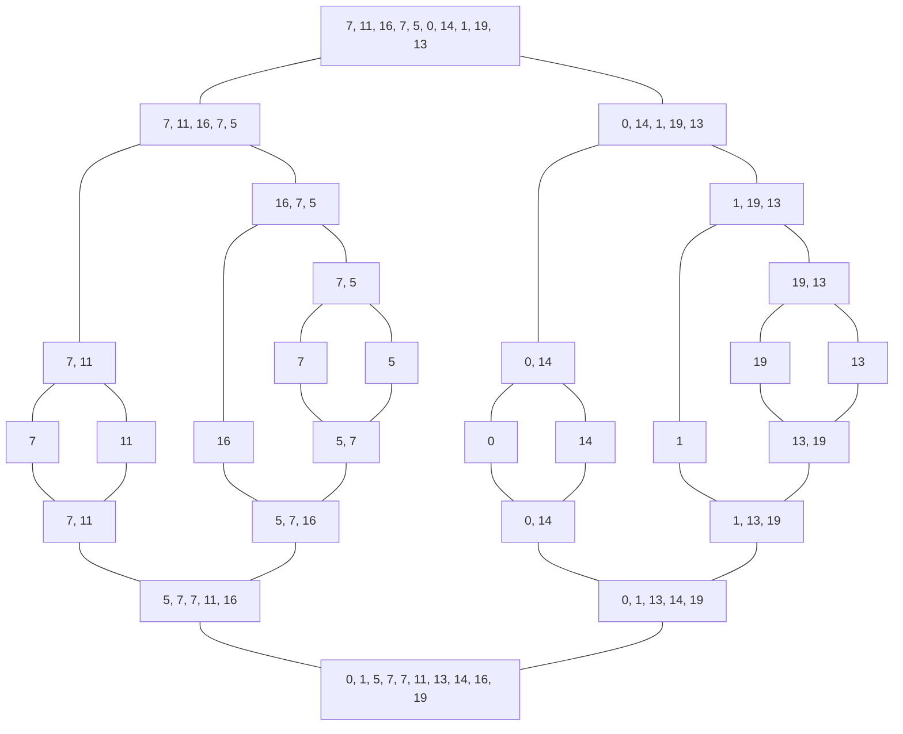

# Operacijske raziskave - vaje 22.2.2021

---

## Zahtevnost algoritmov

* $f \in O(g) \iff \exists C > 0 \ \exists {n_0} \ \forall n \ge {n_0} : \vert f(n) \vert \le C g(n)$ asimptotična zgornja meja
* $f \in \Omega(g) \iff \exists C > 0 \ \exists {n_0} \ \forall n \ge {n_0} : \vert f(n) \vert \ge C g(n)$ asimptotična spodnja meja
* $f \in \Theta(g) \iff f \in O(g) \cap \Omega(g)$ asimptotična natančna meja
* $f(n) = O(g(n))$

---

### Naloga 1

Naj bo $A[1 \dots n][1 \dots n]$ matrika (tj., seznam seznamov) dimenzij $n \times n$. Dan je spodnji program:

```python
for i = 1, ..., n:
    for j = i+1, ..., n:
        A[i][j] <- A[j][i]
```

1. Kaj počne zgornji program?
2. Oceni število korakov, ki jih opravi zgornji program, v odvisnosti od parametra $n$.

----

1. Program preslika del matrike pod diagonalo v del nad diagonalo, tako da je matrika $A$ na koncu simetrična.
2. ${\sum_{i=1}^n} {\sum_{j=i+1}^n} 1 = {\sum_{i=1}^n} (n-i) = {\sum_{i=0}^{n-1}} i = {n (n-1) \over 2} = \Theta(n^2)$

---

### Naloga 2

Naj bo $\ell[1 \dots n]$ seznam, ki ima na začetku vse vrednosti nastavljene na $0$. Dan je spodnji program:

```python
i <- 1
while i <= n:
    l[i] <- 1 - l[i]
    if l[i] = 1:
        i <- 1
    else:
        i <- i+1
```

1. Kaj se dogaja, ko teče zgornji program?
2. Oceni število korakov, ki jih opravi zgornji program, v odvisnosti od parametra $n$.

----

| korak | $\ell[4 \dots 1]$ | $i$ | vrednost |
| ----- | ----------------- | --- | -------- |
|     0 | 0, 0, 0, 0        |   1 | 0
|     1 | 0, 0, 0, 1        |   1 | 1
|     2 | 0, 0, 0, 0        |   2 |
|     3 | 0, 0, 1, 0        |   1 | 2
|     4 | 0, 0, 1, 1        |   1 | 3
|     5 | 0, 0, 1, 0        |   2 |
|     6 | 0, 0, 0, 0        |   3 |
|     7 | 0, 1, 0, 0        |   1 | 4

1. Algoritem simulira $n$-bitni števec.
2. ${\sum_{i=0}^{n-1}} 2^{n-i} = {\sum_{i=1}^n} 2^i = 2^{n+1} - 2 = O(2^n)$

---

### Naloga 3

Algoritem `BubbleSort` uredi vhodni seznam $\ell[1 \dots n]$ tako,
da zamenjuje sosednje elemente v nepravem vrstnem redu:

```python
def BubbleSort(l[1, ..., n]):
    z <- n
    while z > 1:
        y <- 1
        for i = 2, ..., z:
            if l[i-1] > l[i]:
                l[i-1], l[i] <- l[i], l[i-1]
                y <- i
        z <- y-1
```

1. Izvedi algoritem na seznamu $[7, 11, 16, 7, 5]$.
2. Določi časovno zahtevnost algoritma.

----

| $z$ | $y$ | $i$ | $\ell$ |
| --- | --- | --- | ------ |
|   5 |   1 |   2 | 7, 11, 16, 7, 5
|   5 |   1 |   3 | 7, 11, 16, 7, 5
|   5 |   4 |   4 | 7, 11, 7, 16, 5
|   5 |   5 |   5 | 7, 11, 7, 5, 16
|   4 |   1 |   2 | 7, 11, 7, 5, 16
|   4 |   3 |   3 | 7, 7, 11, 5, 16
|   4 |   4 |   4 | 7, 7, 5, 11, 16
|   3 |   1 |   2 | 7, 7, 5, 11, 16
|   3 |   3 |   3 | 7, 5, 7, 11, 16
|   2 |   2 |   2 | 5, 7, 7, 11, 16

* Časovna zahtevnost (najslabši primer - obratno urejen seznam): $O(n^2)$
* Najboljši primer (urejen seznam): $\Omega(n)$

---

### Naloga 4

Algoritem `MergeSort` uredi vhodni seznam tako, da ga najprej razdeli na dva dela, nato vsakega rekurzivno uredi, nazadnje pa zlije dobljena urejena seznama.

1. S psevdokodo zapiši algoritem `MergeSort`.
2. Izvedi algoritem na seznamu $[7, 11, 16, 7, 5, 0, 14, 1, 19, 13]$.
3. Določi časovno zahtevnost algoritma.

----

```python
def MergeSort(l[1, ..., n]):
    if n <= 1:
        return l
    m <- n // 2 # zaokrožimo navzdol
    l1 <- MergeSort(l[1, ..., m])
    l2 <- MergeSort(l[m+1, ..., n])
    i, j, k <- 1, 1, 1
    while j <= m and k <= n-m:
        if l1[j] <= l2[k]:
            l[i] <- l1[j]
            j <- j+1
        else:
            l[i] <- l2[k]
            k <- k+1
        i <- i+1
    while j <= m:
        l[i] <- l1[j]
        j <- j+1
        i <- i+1
    while k <= n-m:
        l[i] <- l2[k]
        k <- k+1
        i <- i+1
    return l
    
```



Krovni izrek:

$$
T(n) = a T\left({n \over b}\right) + O(n^c) = O\left({\sum_{i=0}^{ {\log_b} n}} \left({a \over b^c}\right)^i n^c\right) = \begin{cases}
O(n^c) & a < b^c \\
O(n^c \log n) & a = b^c \\
O(n^{\log_b a}) & a > b^c
\end{cases}
$$

`MergeSort`:
* $a = b = 2$, $c = 1$
* $a = b^c$
* časovna zahtevnost: $O(n \log n)$

---

### Naloga 5

Število $n$ želimo razcepiti na dva netrivialna celoštevilska faktorja, kar storimo s sledečim algoritmom:

```python
def Razcep(n):
    for i = 2, ..., [sqrt(n)]: # koren n, zaokrožen navzdol
        if n/i je celo število:
            return (i, n/i)
    return n je praštevilo
```

Določi časovno zahtevnost algoritma. Ali je ta algoritem polinomski?

---

### Naloga 6

Zapiši rekurziven algoritem, ki na vhod dobi celo število $n$ in teče v času $O(\sqrt{n})$. Uporaba korenjenja ni dovoljena.
