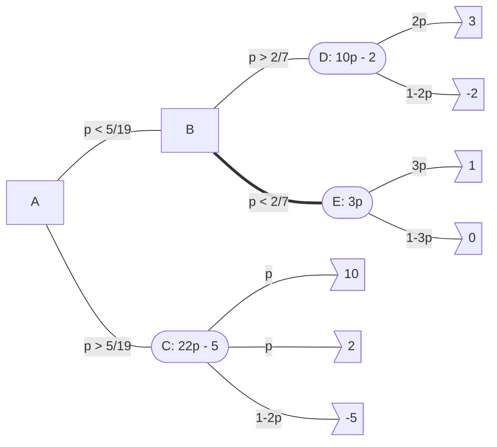
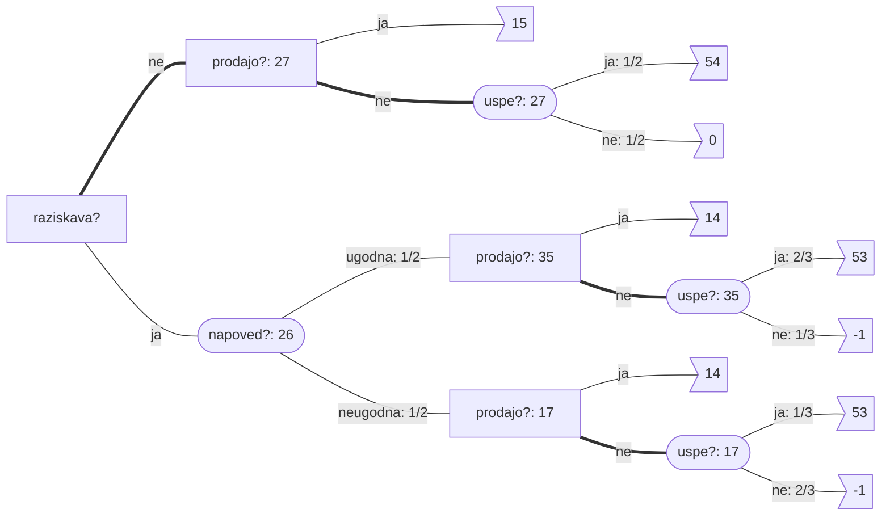
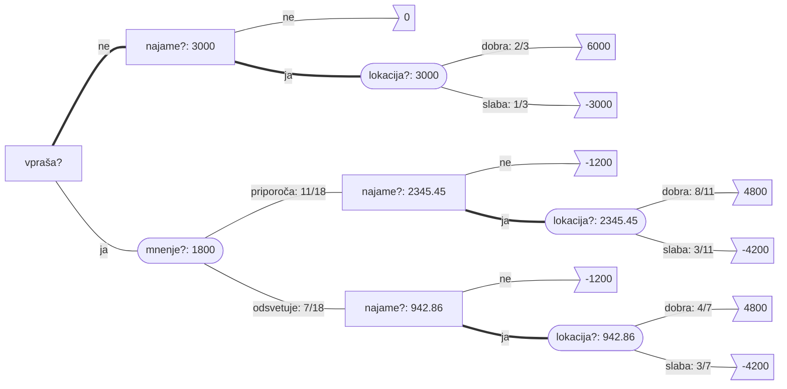
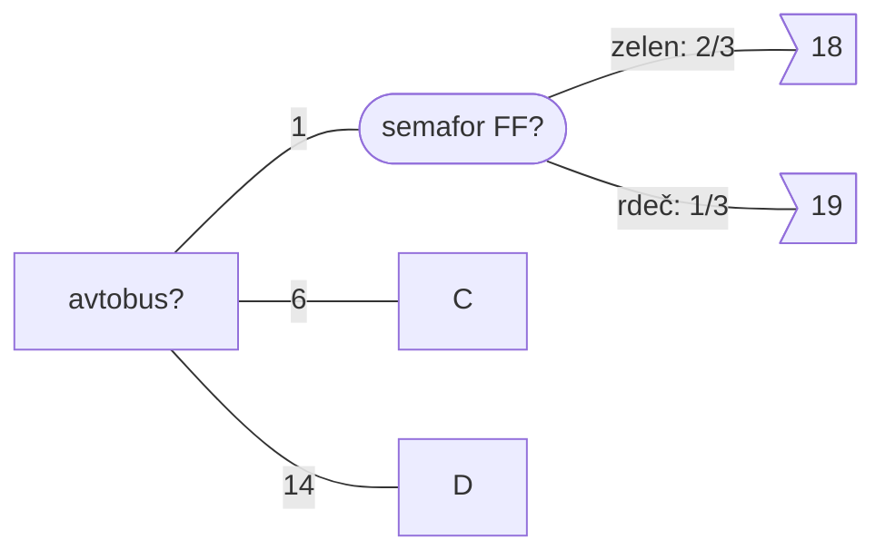

# Operacijske raziskave - vaje 22.3.2021

---

## Odločitvena drevesa

### Naloga 1

Veliki koncert skupine FiM se bo odvijal v dvorani s $100$ neoznačenimi sedeži. Prireditelj se lahko odloči, da proda $100$, $101$, $102$ ali $103$ karte (povpraševanja je dovolj). Znane so verjetnosti ${p_0} = 0.2$, ${p_1} = 0.3$, ${p_2} = 0.4$ in ${p_3} = 0.1$, kjer je ${p_i}$ verjetnost, da $i$ kupcev kart ne pride na koncert (ne glede na število prodanih kart). Vsaka prodana karta prinese $10 €$ dobička, vsak obiskovalec, ki ne bo mogel v dvorano, pa pomeni $30 €$ stroškov (ker je že plačal $10 €$ za karto, ima torej organizator $20 €$ izgube). Koliko kart naj prireditelj proda, da bo pričakovani dobiček čim večji?

----

* $X$ ... dobiček
* $k$ ... število prodanih kart

- $E(X \mid k = 100) = 100 \cdot 10 € = 1000 €$
- $E(X \mid k = 101) = 101 \cdot 10 € - 0.2 \cdot 30 € = 1004 €$
- $E(X \mid k = 102) = 102 \cdot 10 € - 0.2 \cdot 60 € - 0.3 \cdot 30 € = 999 €$
- $E(X \mid k = 103) = 103 \cdot 10 € - 0.2 \cdot 90 € - 0.3 \cdot 60 € - 0.4 \cdot 30 € = 982 €$

Organizator naj proda 101 karto, pričakovani dobiček je tedaj 1004 €.

---

### Naloga 2

Imaš sledeče odločitveno drevo, a nisi prepričan glede vrednosti $p \in [0, 1/3]$. Poišči optimalne odločitve glede na vrednost $p$. Pričakovano vrednost želimo maksimizirati.



----

* $E(D) = 2p \cdot 3 + (1-2p) \cdot (-2) = 10p - 2$
* $E(E) = 3p \cdot 1 + (1-3p) \cdot 0 = 3p$
* $E(C) = p \cdot 10 + p \cdot 2 + (1-2p) \cdot (-5) = 22p - 5$
* odločitev v B:
  - $10p - 2 > 3p$
  - $p > 2/7$: se odločimo za D
  - $p < 2/7$: se odločimo za E
* odločitev v A:
  - $p > 2/7$:
    + $10p - 2 > 22p - 5$
    + $p < 1/4 < 2/7$: se ne more zgoditi
    + se odločimo za C
  - $p < 2/7$:
    + $3p > 22p - 5$
    + $p < 5/19 < 2/7$: se odločimo za B
    + $5/19 < p < 2/7$: se odločimo za C

Odločanje:
* če je $p < 5/19$, se odločimo za B in potem za E
* če je $p > 5/19$, se odločimo za C

---

### Naloga 3

Pacient ima na voljo operacijo. Brez operacije bo živel natanko $3$ mesece. Z uspešno opravljeno operacijo bo živel natanko $12$ mesecev. Operacija je neuspešna z verjetnostjo $0.3$ (v tem primeru pacient dočaka $0$ mesecev). Cilj pacienta je maksimiranje pričakovane življenjske dobe.

1. Ali naj pacient sprejme operacijo?
2. Pacient lahko opravi predhodni test, ki z zanesljivostjo $0.9$ napove uspešnost operacije, vendar z verjetnostjo $0.005$ pacient zaradi komplikacij med testom umre. Ali naj pacient opravi test?

Nariši odločitveno drevo in odločitve sprejmi na podlagi izračunanih verjetnosti!

----

1. * $X$ ... življenjska doba v mesecih
   * $E(X \mid \text{brez operacije}) = 3$
   * $E(X \mid \text{z operacijo}) = 0.7 \cdot 12 + 0.3 \cdot 0 = 8.4$
   * odloči se za operacijo

2. * $P(\text{operacija uspešna}) = 0.7$
   * $P(\text{operacija neuspešna}) = 0.3$
   * $P(\text{ugoden izid} \mid \text{operacija uspešna}) = 0.9$
   * $P(\text{neugoden izid} \mid \text{operacija uspešna}) = 0.1$
   * $P(\text{ugoden izid} \mid \text{operacija neuspešna}) = 0.1$
   * $P(\text{neugoden izid} \mid \text{operacija neuspešna}) = 0.9$
   * $P(\text{ugoden izid}) = 0.7 \cdot 0.9 + 0.3 \cdot 0.1 = 0.66$
   * $P(\text{neugoden izid}) = 0.7 \cdot 0.1 + 0.3 \cdot 0.9 = 0.34$
   * $P(\text{operacija uspešna} \mid \text{ugoden izid}) = 0.7 \cdot 0.9 / 0.66 = 21/22$
   * $P(\text{operacija neuspešna} \mid \text{ugoden izid}) = 0.3 \cdot 0.1 / 0.66 = 1/22$
   * $P(\text{operacija uspešna} \mid \text{neugoden izid}) = 0.7 \cdot 0.1 / 0.34 = 7/34$
   * $P(\text{operacija neuspešna} \mid \text{neugoden izid}) = 0.3 \cdot 0.9 / 0.34 = 27/34$
 
   ```mermaid
   graph LR
   
   A[test?] -- ne --- B[operacija?: 8.4]
   A == ja === C([komplikacije?: 8.54])
   B -- ne --- D>3]
   B == ja === E([uspešna?: 8.4])
   E -- uspešna: 0.7 --- F>12]
   E -- neuspešna: 0.3 --- G>0]
   C -- ja: 0.005 --- H>0]
   C -- ne: 0.995 --- I([izid?: 8.58])
   I -- ugoden: 0.66 --- J[operacija?: 11.45]
   I -- neugoden: 0.34 --- K[operacija?: 3]
   J -- ne --- L>3]
   K == ne === M>3]
   J == ja === N([uspešna?: 11.45])
   K -- ja --- O([uspešna?: 2.47])
   N -- uspešna: 21/22 --- P>12]
   N -- neuspešna: 1/22 --- Q>0]
   O -- uspešna: 7/34 --- R>12]
   O -- neuspešna: 27/34 --- S>0]
   ```

   Odločitve: odloči se za testiranje, če je izid ugoden, gre na operacijo, sicer pa ne.

---

### Naloga 4

Podjetje je razvilo produkt, za katerega je konkurenca pripravljena plačati $15 M€$. Če se odločijo samostojno prodajati produkt, jih vzpostavitev proizvodnje stane $6 M€$, za vsak uspešno prodan produkt pa dobijo $600 €$. Računajo, da bi z verjetnostjo $0.5$ investicija uspela in bi prodali $100000$ produktov, z verjetnostjo $0.5$ pa bi projekt propadel in bi prodali zgolj $10000$ produktov. Podjetje se lahko odloči tudi za neodvisno raziskavo trga. Ta stane $1 M€$, z verjetnostjo $2/3$ pa bo pravilno napovedala uspeh projekta (ne glede na to, ali bi ta uspel ali ne). Kako naj se podjetje odloči?

----



* $P(\text{uspe}) = P(\text{ne uspe}) = 0.5$
* $P(\text{ugodna} \mid \text{uspe}) = P(\text{neugodna} \mid \text{ne uspe}) = 2/3$
* $P(\text{neugodna} \mid \text{uspe}) = P(\text{ugodna} \mid \text{ne uspe}) = 1/3$
* $P(\text{ugodna}) = 0.5 \cdot 2/3 + 0.5 \cdot 1/3 = 1/2$
* $P(\text{neugodna}) = 0.5 \cdot 1/3 + 0.5 \cdot 2/3 = 1/2$
* $P(\text{uspe} \mid \text{ugodna}) = (0.5 \cdot 2/3) / 0.5 = 2/3$
* $P(\text{ne uspe} \mid \text{ugodna}) = (0.5 \cdot 1/3) / 0.5 = 1/3$
* $P(\text{uspe} \mid \text{neugodna}) = (0.5 \cdot 1/3) / 0.5 = 1/3$
* $P(\text{ne uspe} \mid \text{neugodna}) = (0.5 \cdot 2/3) / 0.5 = 2/3$

Odločitev: ne odločijo se za raziskavo, ne prodajo in gredo v lastno proizvodnjo.

---

### Naloga 5

Rexhep Bajrami bi se rad naslednja štiri leta ukvarjal s prodajo sadja in zelenjave (po štirih letih mu poteče delovna viza). Rad bi najel parcelo za stojnico, ki bo stala $6000 €$. Če je lokacija dobra, bo imel $12000 €$ dobička, če pa je lokacija slaba, bo imel le $3000 €$ dobička. Ocenjuje, da je z verjetnostjo $2/3$ lokacija dobra, z verjetnostjo $1/3$ pa slaba.

1. Z odločitvenim drevesom opiši njegove možnosti in ugotovi, kako naj se odloči ter kakšen dobiček naj pričakuje.
2. Za nasvet lahko vpraša znanca Seada, ki "ima nos" za tovrstne posle. Sead mu lahko da nasvet, a zanj zahteva $1200 €$. Dobro je znano, da ima Sead naslednje pogojne verjetnosti $P(\text{Seadovo mnenje} \mid \text{kakovost parcele})$:

   |               | dobra | slaba |
   | ------------- | ----- | ----- |
   | **priporoča** | $2/3$ | $1/2$ |
   | **odsvetuje** | $1/3$ | $1/2$ |

   Ali naj vpraša Seada za nasvet? Kakšen je pričakovani dobiček?

----



* $P(\text{priporoča}) = 2/3 \cdot 2/3 + 1/3 \cdot 1/2 = 11/18$
* $P(\text{odsvetuje}) = 2/3 \cdot 1/3 + 1/3 \cdot 1/2 = 7/18$
* $P(\text{dobra} \mid \text{priporoča}) = {2/3 \cdot 2/3 \over 11/18} = 8/11$
* $P(\text{slaba} \mid \text{priporoča}) = {1/3 \cdot 1/2 \over 11/18} = 3/11$
* $P(\text{dobra} \mid \text{odsvetuje}) = {2/3 \cdot 1/3 \over 7/18} = 4/7$
* $P(\text{slaba} \mid \text{odsvetuje}) = {1/3 \cdot 1/2 \over 7/18} = 3/7$

Naj ne vpraša za mnenje in najame parcelo.

---

### Naloga 6

Mudi se ti na izpit, a ravno v trenutku, ko prideš na postajo Konzorcij, odpelje avtobus številka 1. Na prikazovalniku se izpiše, da bo naslednji avtobus številka 1 prispel čez $10$ minut, naslednji avtobus številka 6 čez $6$ minut, naslednji avtobus številka 14 pa čez $2$ minuti.

Avtobusa 1 in 6 ob ugodnih semaforjih potrebujeta $6$ minut do postaje pri FE, pri čemer se lahko čas vožnje zaradi rdeče luči na semaforju pri FF podaljša za $1$ minuto. Verjetnosti, da bo rdečo luč imel avtobus 1, da bo rdečo luč imel avtobus 6, ter da bosta oba avtobusa imela zeleno luč, so enake $1/3$ (zaradi majhnega razmaka se ne more zgoditi, da bi oba avtobusa naletela na rdečo luč). Avtobus številka 1 nadaljuje pot do postaje pri FMF, za kar potrebuje še $2$ minuti.

Avtobus številka 14 potrebuje $5$ minut do postaje pri študentskih domovih, od tam pa greš peš do postaje pri FE, za kar potrebuješ še $4$ minute. Pri tem prečkaš železnico -- če mimo pripelje vlak (kar se zgodi z verjetnostjo $0.05$), se čas hoje podaljša za $3$ minute. Ko prideš na postajo pri FE (ne glede na to, ali si prišel z avtobusom 6 ali 14), te čakajo še $4$ minute hoje do FMF, vendar moraš najprej prečkati Tržaško cesto. Če je na semaforju rdeča luč (kar se zgodi z verjetnostjo 0.9, neodvisno od drugih dogodkov), se lahko odločiš, da $2$ minuti počakaš na zeleno luč in potem nadaljuješ peš, ali pa da greš nazaj do postaje in počakaš na avtobus številka $1$ (ki bo, tako kot prej, vozil še $2$ minuti do FMF).

Kakšne bodo tvoje odločitve, da bo pričakovano trajanje poti do FMF čim krajše? Nariši odločitveno drevo in odločitve sprejmi na podlagi izračunanih verjetnosti!

----


----


